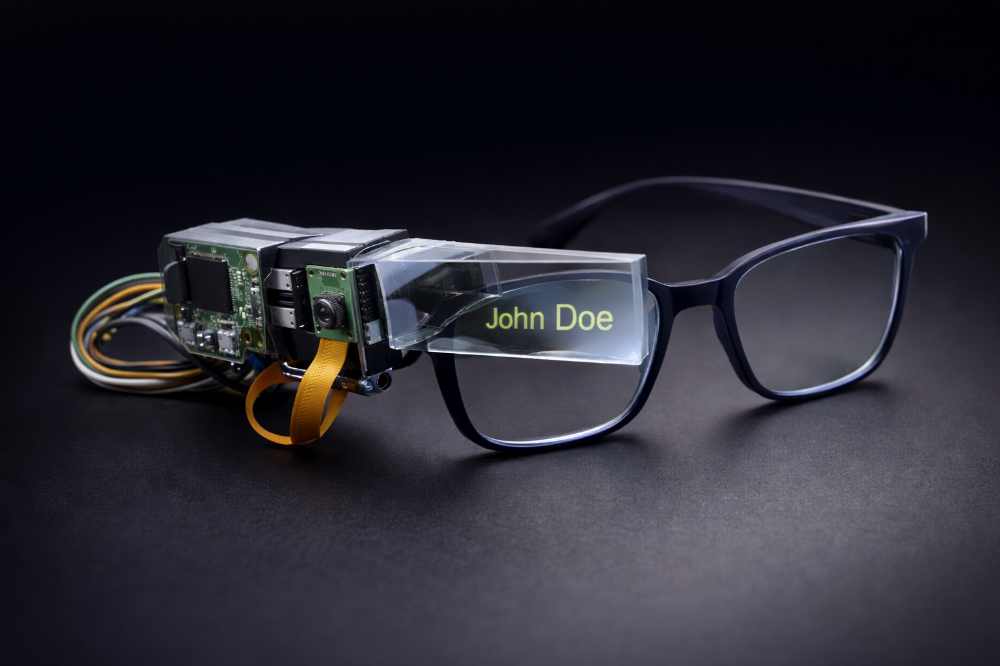

# Smart Glasses – Real-Time Object Detection & Face Recognition System



## 📌 Overview

This project implements an **end-to-end real-time vision system** using **Raspberry Pi Zero** and **AWS EC2** for smart glasses.  
The system captures live video from a Raspberry Pi camera, streams it to an AWS server, performs **object detection** and **face recognition**, and sends the results back to the device for **OLED display** and **audio feedback**.

The architecture is modular: **object detection**, **face recognition**, and **image management** run as independent services and are executed one at a time based on the selected use case.

---

## 🧠 System Architecture

**Edge Device (Raspberry Pi Zero):**
- Raspberry Pi Camera Module
- Live video capture and Base64 streaming
- OLED display for detected results
- Audio feedback using `espeak-ng`
- Flask-based image management system

**Cloud (AWS EC2 – Ubuntu):**
- Object detection using **YOLOv8 (custom trained)**
- Face recognition using **MobileFaceNet (Paddle Inference)**
- Flask + Socket.IO for real-time communication

---

## 🔁 Data Flow

1. Raspberry Pi captures frames using `PiCamera`
2. Frames are Base64-encoded and streamed via **Socket.IO**
3. AWS server receives frames and performs:
   - Object detection **OR**
   - Face recognition
4. Processed frames and detected labels are sent back
5. Raspberry Pi:
   - Displays results on OLED
   - Speaks detected labels using text-to-speech

---

## 📂 Project Structure

```

You said:
Uploaded image
Uploaded image
thIS IS THE IMAGES OF A SMART GLASS I CREATED WITH RASPBERRYPI ZERO, AND RASPBERRYPI CAMERA MODULE , USED JUMP WIRES TO CONNECT , STREAMED VIDEOS TO AWS REMOTE SERVER AND RETURNED RECOGNISED FACE AS TEXT(NAME )AND DISPLAYED IT USING A OLED DISPLAY AND REFLECTED IT WITH MIRROR AND MAGNIFIED WITH A LENSE AND MAKE IT APPEAR ON SPECTACLE MIMICING A SMART GLASS. CAN YOU CREATE A NICE VERSION OF THE GLASS I CREATED 
ChatGPT said:

Image created
•
Smart glasses with face recognition display
Generated image
Generated image
Generated image


Share
You said:
EXTEND THE MIRROR PLACED TO FEW MORE LENGTH
ChatGPT said:

Image created
•
Augmented reality smart glasses close-up
Generated image
Generated image
Generated image


Share
You said:
IT LOOKS LIKE THE CAMERA IS PLACED ON SIDE NOT FRONT , GET A TOP VIEW AS THE IMAGE I PROVIDED
ChatGPT said:

Image created
•
Smart glasses with AR display
Generated image
Generated image
Generated image


Share
You said:
Uploaded image
THIS IS HOW IT LOOKS FROM TOP , YOU CAN SEE RASPBERRYPI MODULE PLACED UPSIDE DOWN AND HAVE A OLED DISPLAY NEAR IT PLACED VERTICALLY FROM WHICH THE IMAGE IS REFLECTED WITH A MIRROR PLACED AT AN ANGLE 45 DEGREE FROM OLED (WHICH IS ALSO VERTICALLY PLACED)WHICH IN TURN FALLS IN A TRANSPARENT GLASS PROJECTING FRONT SIDE TO SPECTACLE GLASS AND BEFOR THAT A LECE IS PLACED IN PATH. CAMERA IS PLACED FRONT ,RIGHT SIDE WHICH MAY NOT BE MUCH VISIBLE FROM FRONT VIEW.JUST GENERATE A TOP VIEW IMAGE FROM DESCRIPTON AND ORIGINAL IMAGE
ChatGPT said:

Image created
•
DIY smart glasses with Raspberry Pi Zero
Generated image
Generated image
Generated image


Share
You said:
Uploaded image
GIVE ME GOOD TOP VIEW OF THIS
ChatGPT said:

Image created
•
DIY AR smart glasses with Raspberry Pi
Generated image
Generated imageGenerated image
Generated imageGenerated image


Share
You said:
obj_stream.py is used to stream videos captured by raspberrypi camera module and streamed using raspberrypi zero which is recieved on a remote aws server. in aws i have face_detector.py and object_detector.py which are used to do its operations seperatly but it is implimented in such a way that only one process will work at a time , based on what you run . i have yolov8n.pt which i used to retrain with labelImg and mobilefacenet infer used to predict faces in my aws ubuntu machine. and i also have a flask app for managing images seperatly to capture images of persons , create embeddings using mobilefacenet ,to delete images, etc
obj_stream.py is 
import time
import base64
import socketio
import cv2
import numpy as np
from picamera import PiCamera
from io import BytesIO
import signal
import sys
import threading
import os

# OLED Display Libraries
try:
    import board
    import busio
    from adafruit_ssd1306 import SSD1306_I2C
    from PIL import Image, ImageDraw, ImageFont
    OLED_AVAILABLE = True
except ImportError:
    print("⚠️ OLED library not found. Detected objects will be printed in the terminal.")
    OLED_AVAILABLE = False

# Global OLED variables
disp = None
font = None


def initialize_oled():
    """ Initializes the OLED display if available. """
    global disp, font, OLED_AVAILABLE
    if OLED_AVAILABLE:
        try:
            print("⏳ Initializing OLED...")
            i2c = busio.I2C(board.SCL, board.SDA)
            disp = SSD1306_I2C(128, 64, i2c)  # Ensure this matches your OLED size (128x32 or 128x64)
            disp.fill(0)
            disp.show()
            font =ImageFont.truetype("/usr/share/fonts/truetype/dejavu/DejaVuSans-Bold.ttf", 24)
            print("✅ OLED Initialized Successfully!")
        except Exception as e:
            print(f"❌ OLED initialization failed: {e}")
            OLED_AVAILABLE = False

# Run OLED initialization in a separate thread
oled_thread = threading.Thread(target=initialize_oled, daemon=True)
oled_thread.start()

# Initialize Flask-SocketIO client
sio = socketio.Client()
REMOTE_SERVER_URL = "http://18.209.57.101:5000"

@sio.on("detected_objects")
def receive_detected_objects(data):
    """ Displays detected objects on OLED or prints to terminal. """
    if OLED_AVAILABLE and disp is not None:
        try:
            # Create image canvas
            image = Image.new("1", (disp.width, disp.height))
            draw = ImageDraw.Draw(image)
            draw.text((0, 0), f"{data}", font=font, fill=255)
            disp.image(image)
            disp.show()  # Use .show() instead of .display()
            os.system("espeak-ng '{data}'")
        except Exception as e:
            print(f"⚠️ OLED display error: {e}")
    else:
        print(f"📢 Detected Objects: {data}")

def stop_signal_handler(sig, frame):
    """ Handles SIGTERM & SIGINT to stop streaming gracefully. """
    global camera, sio
    print("🛑 Received stop signal, stopping streaming...")

    try:
        if 'camera' in globals() and camera is not None:
            camera.close()
            print("📷 Camera closed.")

        if sio.connected:
            sio.disconnect()
            print("🔌 SocketIO disconnected.")

    except Exception as e:
        print(f"⚠️ Error during cleanup: {e}")

    sys.exit(0)  # Exit gracefully

# Register the SIGTERM and SIGINT (Ctrl+C) handlers
signal.signal(signal.SIGTERM, stop_signal_handler)
signal.signal(signal.SIGINT, stop_signal_handler)

def send_frames():
    """ Captures and streams frames from PiCamera to the remote server. """
    camera = PiCamera()
    camera.resolution = (320, 240)
    camera.framerate = 10
    stream = BytesIO()

    try:
        sio.connect(REMOTE_SERVER_URL)
        print("✅ Connected to remote server!")

        while True:
            camera.capture(stream, format="jpeg", use_video_port=True)
            img_base64 = base64.b64encode(stream.getvalue()).decode("utf-8")
            sio.emit("video_feed", img_base64)

            stream.seek(0)
            stream.truncate()
            time.sleep(0.1)

    except Exception as e:
        print(f"❌ ERROR: {e}")

    finally:
        camera.close()
        sio.disconnect()

@sio.on("stop_stream")
def stop_stream():
    """ This function is triggered when Flask sends a stop signal. """
    global camera, sio
    try:
        import subprocess
        subprocess.run(["pkill", "-f", "local_stream.py"])  # Kill the running process
        return "🛑 Streaming stopped!", 200
    except Exception as e:
        return f"❌ Error: {str(e)}", 500
    if camera:
        camera.close()

if __name__ == "__main__":
    send_frames()

and in aws i have 
remote_object_detector.py 
import eventlet
eventlet.monkey_patch()

from flask import Flask, render_template_string
from flask_socketio import SocketIO, emit
import cv2
import numpy as np
import base64
from ultralytics import YOLO

app = Flask(__name__)
socketio = SocketIO(app, cors_allowed_origins="*", async_mode="eventlet")

# Load YOLOv8 model
model = YOLO("yolov8n.pt")

@app.route('/')
def index():
    return render_template_string("""
    <html>
    <head>
        <title>Live Video</title>
        <script src="https://cdnjs.cloudflare.com/ajax/libs/socket.io/4.0.1/socket.io.js"></script>
        <script>
            var socket = io.connect('http://' + document.domain + ':' + location.port);
            socket.on('frame', function(data) {
                document.getElementById('video_feed').src = 'data:image/jpeg;base64,' + data;
            });

            socket.on('detected_objects', function(objects) {
                document.getElementById('detected_objects').innerText = "Detected: " + objects;
            });
        </script>
    </head>
    <body>
        <h1>Live Video Feed with Object Detection</h1>
        <p id="detected_objects">Waiting for detections...</p>
        
    </body>
    </html>
    """)

@socketio.on('video_feed')
def handle_frame(frame):
    try:
        # Decode Base64 frame
        img_data = base64.b64decode(frame)
        np_arr = np.frombuffer(img_data, np.uint8)
        img = cv2.imdecode(np_arr, cv2.IMREAD_COLOR)

        # Run YOLOv8 object detection
        results = model(img)

        detected_objects = set()
        for result in results:
            for box in result.boxes:
                cls = int(box.cls[0])  # Class ID
                name = model.names[cls]  # Get class name
                detected_objects.add(name)

                # Draw bounding box
                x1, y1, x2, y2 = map(int, box.xyxy[0])  # Get bounding box coordinates
                cv2.rectangle(img, (x1, y1), (x2, y2), (0, 255, 0), 2)
                cv2.putText(img, name, (x1, y1 - 10), cv2.FONT_HERSHEY_SIMPLEX, 0.5, (0, 255, 0), 2)

        # Convert processed frame back to Base64
        _, buffer = cv2.imencode('.jpg', img)
        frame_base64 = base64.b64encode(buffer).decode()

        # Emit updated frame to the web client
        socketio.emit("frame", frame_base64)

        # Send detected objects back to Raspberry Pi
        detected_objects_str = ", ".join(detected_objects) if detected_objects else "No objects detected"
        socketio.emit("detected_objects", detected_objects_str)

    except Exception as e:
        print(f"❌ Error processing frame: {e}")

if __name__ == "__main__":
    print("🚀 Remote video streaming server started...")
    socketio.run(app, host="0.0.0.0", port=5000, debug=True)
and imageServer.py
from flask import Flask, request, jsonify, render_template,url_for
import os
import  cv2
import numpy as np
import pickle
import paddle.inference as paddle_infer


app = Flask(__name__)

UPLOAD_FOLDER = "static/images"
os.makedirs(UPLOAD_FOLDER, exist_ok=True)
HAARCASCADE_PATH ="haarcascade_frontalface_default.xml"
face_detector = cv2.CascadeClassifier(HAARCASCADE_PATH)

def preprocess_face(face_img):
    face_img = cv2.resize(face_img, (112, 112))
    face_img = cv2.cvtColor(face_img, cv2.COLOR_BGR2RGB)
    face_img = face_img.astype("float32") / 255.0 
    face_img = np.transpose(face_img, (2, 0, 1))  
    return np.expand_dims(face_img, axis=0)  

def get_embedding(face_input, predictor):
    input_names = predictor.get_input_names()
    input_tensor = predictor.get_input_handle(input_names[0])
    input_tensor.copy_from_cpu(face_input)
    predictor.run()
    output_names = predictor.get_output_names()
    output_tensor = predictor.get_output_handle(output_names[0])
    embedding = output_tensor.copy_to_cpu()
    return embedding


@app.route('/')
def index():
    """Displays the upload page."""
    return render_template('upload.html')

@app.route('/upload', methods=['POST'])
def upload_file():
    """Receives and saves uploaded images."""
    if 'file' not in request.files:
        return jsonify({"error": "No file part"}), 400
    
    file = request.files['file']
    if file.filename == '':
        return jsonify({"error": "No selected file"}), 400
    file_path = os.path.join(UPLOAD_FOLDER, file.filename)
    file.save(file_path)
    
    return jsonify({"message": f"File {file.filename} uploaded successfully"}), 200


def create_face_database(image_folder="images", pickle_file="face_database.pkl", predictor=None):
    face_db = {}
    image_folder=os.path.join("static",image_folder)
    
    for image_name in os.listdir(image_folder):
        image_path = os.path.join(image_folder, image_name)
        img = cv2.imread(image_path)
        if img is None:
            print(f"Could not read {image_name}. Skipping.")
            continue
        gray = cv2.cvtColor(img, cv2.COLOR_BGR2GRAY)
        gray = cv2.equalizeHist(gray)
        faces = face_detector.detectMultiScale(gray, scaleFactor=1.2, minNeighbors=3, minSize=(20, 20))
        if len(faces) == 0:
            print(f"No face detected in {image_name}. Skipping.")
            continue
        # Assume the first detected face is the target face
        (x, y, w, h) = faces[0]
        padding = 20
        x, y = max(0, x - padding), max(0, y - padding)
        w, h = min(img.shape[1] - x, w + 2 * padding), min(img.shape[0] - y, h + 2 * padding)
        face_roi = img[y:y+h, x:x+w]
        face_preprocessed = preprocess_face(face_roi)
        embedding = get_embedding(face_preprocessed, predictor)

        # Use the filename (without extension) as the unique identifier
        name = os.path.splitext(image_name)[0]
        embedding = embedding.flatten() 
        face_db[name] = embedding / np.linalg.norm(embedding) # Convert to (128,)
  # Normalize to unit vector

        print(f"Processed {image_name} and added to database.")
    with open(pickle_file, "wb") as f:
        pickle.dump(face_db, f)
    print(f"Face database saved to {pickle_file}")

def load_predictor(model_dir="mobileface_v1.0_infer"):
    model_file = os.path.join(model_dir, "inference.pdmodel")
    params_file = os.path.join(model_dir, "inference.pdiparams")
    config = paddle_infer.Config(model_file, params_file)
    config.disable_gpu()  # Use CPU; change if you have GPU available
    predictor = paddle_infer.create_predictor(config)
    return predictor


@app.route('/extract')
def extract():
    predictor = load_predictor("mobileface_v1.0_infer")
    create_face_database(image_folder="images", pickle_file="face_database.pkl", predictor=predictor)
    return "Embeddings created for all images!"


if __name__ == '__main__':
    app.run(host='0.0.0.0', port=5000, debug=True)
and face_detector.py 
import eventlet
eventlet.monkey_patch()

from flask import Flask, render_template_string
from flask_socketio import SocketIO, emit
import cv2
import numpy as np
import base64
import pickle
import paddle
import paddle.inference as paddle_infer

app = Flask(__name__)
socketio = SocketIO(app, cors_allowed_origins="*", async_mode="eventlet")

# Load PaddlePaddle MobileFaceNet Model
MODEL_PATH = "mobileface_v1.0_infer/inference.pdmodel"

PARAMS_PATH = "mobileface_v1.0_infer/inference.pdiparams"
FACE_CASCADE_PATH = "haarcascade_frontalface_default.xml"
FACE_DATABASE_PATH = "face_database.pkl"

# Load Haarcascade for Face Detection
face_cascade = cv2.CascadeClassifier(FACE_CASCADE_PATH)

# Load Face Embeddings Database
with open(FACE_DATABASE_PATH, "rb") as f:
    face_database = pickle.load(f)  # Dictionary { "name": numpy_embedding }

# Initialize Paddle Inference
config = paddle_infer.Config(MODEL_PATH, PARAMS_PATH)
config.disable_gpu()  # Ensure CPU usage
predictor = paddle_infer.create_predictor(config)
input_handle = predictor.get_input_handle(predictor.get_input_names()[0])

output_handle = predictor.get_output_handle(predictor.get_output_names()[0])

def preprocess_face(face_img):
    
    face_img = cv2.resize(face_img, (112, 112))
    face_img = cv2.cvtColor(face_img, cv2.COLOR_BGR2RGB)
    face_img = face_img.astype("float32") / 255.0  # Normalize
    face_img = np.transpose(face_img, (2, 0, 1))  # Convert to CHW format
    return np.expand_dims(face_img, axis=0)  # Add batch dimension


def extract_embedding(face_img):
    processed_face = preprocess_face(face_img)
    input_handle.copy_from_cpu(processed_face)
    predictor.run()
    embedding = output_handle.copy_to_cpu().squeeze()
    
    return embedding / np.linalg.norm(embedding)   # Normalize embedding


def recognize_face(face_img):
    """Compare extracted embedding with database and return recognized name."""
    embedding = extract_embedding(face_img)

    best_match = "Unknown"
    max_similarity = -1 

    for name, saved_embedding in face_database.items():
        similarity = np.dot(embedding, saved_embedding) # Cosine Similarity
        if similarity > max_similarity:
            max_similarity = similarity
            best_match = name

    return best_match if max_similarity > 0.5 else "Unknown"  # Set threshold for recognition

@app.route('/')
def index():
    return render_template_string("""
    <html>
    <head>
        <title>Live Face Recognition</title>
        <script src="https://cdnjs.cloudflare.com/ajax/libs/socket.io/4.0.1/socket.io.js"></script>
        <script>
            var socket = io.connect('http://' + document.domain + ':' + location.port);
            socket.on('frame', function(data) {
                document.getElementById('video_feed').src = 'data:image/jpeg;base64,' + data;
            });

            socket.on('detected_objects', function(data) {
                document.getElementById('detected_faces').innerText = "Recognized: " + data;
            });
        </script> </head>
    <body>
        <h1>Live Face Recognition</h1>
        <p id="detected_faces">Waiting for faces...</p>
        
    </body>
    </html>
    """)
@socketio.on('video_feed')
def handle_frame(frame):
    try:
        # Decode Base64 Frame
        img_data = base64.b64decode(frame)
        np_arr = np.frombuffer(img_data, np.uint8)
        img = cv2.imdecode(np_arr, cv2.IMREAD_COLOR)

        # Convert to Grayscale for Face Detection
        gray = cv2.cvtColor(img, cv2.COLOR_BGR2GRAY)
        gray = cv2.equalizeHist(gray)
        # Detect Faces using Haarcascade
        faces = face_cascade.detectMultiScale(gray, scaleFactor=1.2, minNeighbors=3, minSize=(20, 20))

        recognized_faces = []

        for (x, y, w, h) in faces:
            padding = 20  # Increase the face region by 10 pixels
            x, y = max(0, x - padding), max(0, y - padding)
            w, h = min(img.shape[1] - x, w + 2 * padding), min(img.shape[0] - y, h + 2 * padding)
            face = img[y:y+h, x:x+w]  # Extract Face ROI


            name = recognize_face(face)  # Recognize Face

            recognized_faces.append(name)

            # Draw Bounding Box and Name
            color = (0, 255, 0) if name != "Unknown" else (0, 0, 255)
            cv2.rectangle(img, (x, y), (x+w, y+h), color, 2)
            cv2.putText(img, name, (x, y - 10), cv2.FONT_HERSHEY_SIMPLEX, 0.5, color, 2)

        # Convert Processed Frame Back to Base64
        _, buffer = cv2.imencode('.jpg', img)
        frame_base64 = base64.b64encode(buffer).decode()
        # Emit Updated Frame to Web Client
        socketio.emit("frame", frame_base64)

        # Send Recognized Names to Local Flask App
        recognized_faces_str = ", ".join(recognized_faces) if recognized_faces else "No faces detected"
        socketio.emit("detected_objects", recognized_faces_str,include_self=False)

    except Exception as e:
        print(f"❌ Error processing frame: {e}")
if __name__ == "__main__":
    print("🚀 Remote face recognition server started...")
    socketio.run(app, host="0.0.0.0", port=5000, debug=True)
and imageManage.py is 
from flask import Flask, render_template, request, redirect, url_for, Response
from picamera import PiCamera
import time
import os
import threading
import io
import requests

import subprocess

import atexit
import signal


app = Flask(__name__)

# Ensure 'static' folder exists
if not os.path.exists("static"):
    os.makedirs("static")

EC2_URL="http://44.223.28.223:5000/upload"

camera = None
streaming = False  # Global flag to manage streaming state
stream_lock = threading.Lock()  # Ensures thread-safe operations
def init_camera():
    """Safely initialize the camera when needed."""
    global camera
    with stream_lock:
        if camera is None:
            camera = PiCamera()
            camera.resolution = (320, 240)
            camera.framerate = 10
            time.sleep(2)  # Let the camera adjust

def release_camera():
    """Properly release the camera resource."""
    global camera
    with stream_lock:
        if camera:
            try:
                camera.close()
                print("Camera released successfully")
            except Exception as e:
                print(f"Error closing camera: {e}")
            finally:
                camera = None
                time.sleep(1)
# Import for in-memory streaming


def generate_frames():
    """Continuously capture frames from PiCamera and send as MJPEG stream."""
    global streaming
    init_camera()

    stream = io.BytesIO()  # Use an in-memory stream

    while streaming:
        with stream_lock:
            camera.capture(stream, format="jpeg", use_video_port=True)
            stream.seek(0)
            frame_bytes = stream.read()
            stream.seek(0)
            stream.truncate()  # Clear the stream for the next frame

        yield (b'--frame\r\n'
               b'Content-Type: image/jpeg\r\n\r\n' + frame_bytes + b'\r\n')
        time.sleep(0.1)  # Adjust frame rate if needed

@app.route('/')
def index():
    return render_template('imIndex.html')

@app.route('/manage_images')
def manage_images():
    """List saved images in the static folder."""
    images = [f for f in os.listdir("static") if f.endswith(".jpg")]
    return render_template('manage_img.html', images=images)

@app.route('/start_stream', methods=['POST'])
def start_stream():
    """Start live streaming."""
    global streaming
    streaming = True
    return "Streaming Started", 200

@app.route('/stop_stream', methods=['POST'])
def stop_stream():
    """Stop live streaming and release camera."""
    global streaming
    streaming = False
    release_camera()
    return "Streaming Stopped", 200

@app.route('/video_feed')
def video_feed():
    """Route to serve the video feed."""
    return Response(generate_frames(), mimetype='multipart/x-mixed-replace; boundary=frame')
@app.route('/capture', methods=['POST'])
def capture():
    """Capture an image safely."""
    global streaming
    streaming = False  # Ensure streaming stops
    release_camera()  # Release camera first

    init_camera()  # Reinitialize after releasing

    image_name = request.form.get('image_name', '').strip()
    if not image_name:
        return "Error: Please enter a valid image name.", 400

    image_name = image_name.replace(" ", "_") + ".jpg"
    image_path = f'static/{image_name}'

    with stream_lock:
        camera.capture(image_path)

    release_camera()  # Release after capturing

    return redirect(url_for('manage_images'))

@app.route('/delete_image/<image_name>', methods=['POST'])
def delete_image(image_name):
    """Delete an image from the static folder."""
    image_path = os.path.join("static", image_name)

    if os.path.exists(image_path):
        os.remove(image_path)
        return {"success": True}
    else:
        return {"success": False, "error": "File not found"}, 404

@app.route('/send_images')
def send_images():
    """Send images from static folder to EC2 server."""
    image_folder = "static"
    files = [f for f in os.listdir(image_folder) if f.endswith(".jpg")]

    for image in files:
        file_path = os.path.join(image_folder, image)
        with open(file_path, 'rb') as f:
            files = {'file': f}
            response = requests.post(EC2_URL, files=files)
            print(response.json())
    os.system("espeak-ng 'image sent'")
    return "Images sent to EC2", 200
def on_exit():
    os.system("espeak-ng 'goodbye'")

# Run the exit function when the script stops
atexit.register(on_exit)

# Handle SIGINT (Ctrl+C) and SIGTERM (kill command)
def handle_signal(signum, frame):
    print("\n🛑 Flask app is shutting down...")
    on_exit()  # Call exit function
    exit(0)

signal.signal(signal.SIGINT, handle_signal)  # Handle Ctrl+C
signal.signal(signal.SIGTERM, handle_signal)

if __name__ == '__main__':
    os.system("espeak-ng 'welcome to image management'")
    app.run(host='0.0.0.0', port=5000, debug=True)
and in root folder i have 
mobileface_v1.0_infer folder ,templates folder (),haarcascade_frontalface_default.xml,yolov8n.pt.
can you help me to design readme.md
i need to first add an image 
ChatGPT said:
Below is a clean, professional README.md draft tailored to your Raspberry Pi → AWS real-time vision pipeline, written in a way that will make sense to evaluators, recruiters, and collaborators.
It starts with an image section, as you requested, and then clearly explains architecture, components, and execution flow.

You can copy-paste this directly into README.md and adjust image names if required.

Smart Glasses – Real-Time Object Detection & Face Recognition System

End-to-end real-time video streaming and intelligent perception system using Raspberry Pi Zero, AWS EC2, YOLOv8, and MobileFaceNet.

📌 Project Overview
This project implements a distributed computer vision system designed for smart glasses / edge-vision devices.
A Raspberry Pi Zero captures live video and streams it to an AWS EC2 server, where object detection and face recognition are performed independently.
Detected results are sent back to the device for OLED display and audio feedback.

The system also includes a separate image management and face enrollment service to create and manage face embeddings.

🧠 Key Capabilities
Real-time video streaming from Raspberry Pi camera

Object detection using YOLOv8 (custom-trained)

Face recognition using MobileFaceNet (Paddle Inference)

Bidirectional communication via Flask-SocketIO

OLED display + voice feedback on device

Face image capture, embedding creation, and deletion

CPU-only inference (no GPU dependency)

🏗️ System Architecture
┌────────────────────┐
│ Raspberry Pi Zero  │
│--------------------│
│ PiCamera           │
│ obj_stream.py      │─── Base64 Frames ───▶ AWS EC2
│ OLED + Audio       │◀── Detection Result ─┘
└────────────────────┘

        AWS EC2 (Ubuntu)
┌─────────────────────────────────────┐
│ Flask + SocketIO                     │
│-------------------------------------│
│ remote_object_detector.py (YOLOv8)   │
│ face_detector.py (MobileFaceNet)     │
│ imageServer.py (Face DB creation)    │
└─────────────────────────────────────┘
📂 Project Structure
.
├── RaspberryPi/
│   ├── obj_stream.py          # Video streaming + OLED output
│   └── imageManage.py         # Image capture & upload
│
├── AWS/
│   ├── remote_object_detector.py
│   ├── face_detector.py
│   ├── imageServer.py
│
├── mobileface_v1.0_infer/     # Paddle inference model
├── yolov8n.pt                 # YOLOv8 model (custom trained)
├── haarcascade_frontalface_default.xml
├── templates/
│   ├── upload.html
│   ├── imIndex.html
│   └── manage_img.html
└── README.md
🎥 Raspberry Pi Components
obj_stream.py
Captures frames from PiCamera

Streams frames to AWS using SocketIO

Receives detection results

Displays output on OLED

Provides voice feedback using espeak-ng

imageManage.py
Live MJPEG stream for preview

Capture images of individuals

Manage stored images

Upload images to AWS for embedding creation

☁️ AWS Server Components
remote_object_detector.py
Receives live frames

Performs object detection using YOLOv8

Sends:

Annotated frames to browser

Detected object labels back to Raspberry Pi

face_detector.py
Detects faces using Haarcascade

Extracts embeddings using MobileFaceNet

Compares embeddings with stored database

Performs cosine similarity–based recognition

imageServer.py
Receives uploaded face images

Creates normalized face embeddings

Stores embeddings in face_database.pkl

Supports image upload and deletion

🔁 Execution Flow
Raspberry Pi captures video frames

Frames are Base64-encoded and streamed to AWS

AWS runs either:

Object detection (YOLOv8)

Face recognition (MobileFaceNet)

Results are:

Rendered on browser

Sent back to Raspberry Pi

Raspberry Pi displays results on OLED and speaks them

⚠️ Object detection and face recognition currently run as separate services (one at a time).

🧪 Models Used
Task	Model	Framework
Object Detection	YOLOv8n (custom-trained)	Ultralytics
Face Recognition	MobileFaceNet	Paddle Inference
Face Detection	Haarcascade	OpenCV
🖥️ Requirements
Raspberry Pi
Raspberry Pi Zero

PiCamera

OLED display (SSD1306)

Python 3.7+

AWS EC2
Ubuntu 20.04+

Python 3.8+

CPU-only instance (t2 / t3 sufficient)

🚀 How to Run (High Level)
On AWS EC2
python remote_object_detector.py
# OR
python face_detector.py
On Raspberry Pi
python obj_stream.py
Face Enrollment
python imageServer.py
# Upload images → /extract
🔮 Future Improvements
Run object detection and face recognition in parallel

Replace Haarcascade with RetinaFace

Add async inference queue

Optimize bandwidth using frame skipping

Migrate to WebRTC

Add model switch API (runtime control)

📜 License
This project is for educational and research purposes.

If you want, next I can:

Split this into Raspberry Pi README + AWS README

Add architecture diagram image

Rewrite it for GitHub portfolio / resume

Convert this into a research-style project description

Just tell me.

You said:
give me a markdown cell
ChatGPT said:
Below is a single Markdown cell you can paste directly (for example, into README.md or a Jupyter/Markdown editor).
It starts with an image, as you requested.

# Smart Glasses – Real-Time Object Detection & Face Recognition


**End-to-end real-time vision system** using Raspberry Pi Zero and AWS EC2 for live video streaming, object detection (YOLOv8), and face recognition (MobileFaceNet).

- Live video streamed from Raspberry Pi camera to AWS
- Object detection and face recognition run as independent services
- Results sent back to device for OLED display and audio feedback
- Face image management and embedding creation via Flask
If you want:

only the image markdown, or

a different caption, or

the image centered / resized for GitHub

tell me and I will adjust it precisely.

You said:
give me full markdown cell for readme.md
ChatGPT said:
# Smart Glasses – Real-Time Object Detection & Face Recognition System


## 📌 Overview

This project implements an **end-to-end real-time vision system** using **Raspberry Pi Zero** and **AWS EC2** for smart glasses.  
The system captures live video from a Raspberry Pi camera, streams it to an AWS server, performs **object detection** and **face recognition**, and sends the results back to the device for **OLED display** and **audio feedback**.

The architecture is modular: **object detection**, **face recognition**, and **image management** run as independent services and are executed one at a time based on the selected use case.

---

## 🧠 System Architecture

**Edge Device (Raspberry Pi Zero):**
- Raspberry Pi Camera Module
- Live video capture and Base64 streaming
- OLED display for detected results
- Audio feedback using `espeak-ng`
- Flask-based image management system

**Cloud (AWS EC2 – Ubuntu):**
- Object detection using **YOLOv8 (custom trained)**
- Face recognition using **MobileFaceNet (Paddle Inference)**
- Flask + Socket.IO for real-time communication

---

## 🔁 Data Flow

1. Raspberry Pi captures frames using `PiCamera`
2. Frames are Base64-encoded and streamed via **Socket.IO**
3. AWS server receives frames and performs:
   - Object detection **OR**
   - Face recognition
4. Processed frames and detected labels are sent back
5. Raspberry Pi:
   - Displays results on OLED
   - Speaks detected labels using text-to-speech

---
## 📂 Project Structure
```
├── obj_stream.py # Streams video from Raspberry Pi to AWS
├── imageManage.py # Local image capture & management (Raspberry Pi)
├── imageServer.py # AWS image upload & embedding creation
├── remote_object_detector.py # AWS YOLOv8 object detection server
├── face_detector.py # AWS face recognition server
├── mobileface_v1.0_infer/ # MobileFaceNet inference model (Paddle)
├── yolov8n.pt # YOLOv8 model (custom trained)
├── haarcascade_frontalface_default.xml
├── templates/ # HTML templates for Flask apps
├── static/
│ └── images/ # Stored face images
└── README.md
```

---

## 🚀 Features

- Real-time video streaming over Socket.IO
- YOLOv8 object detection (custom dataset via LabelImg)
- Face recognition using MobileFaceNet embeddings
- OLED display integration on smart glasses
- Audio feedback for detected objects/faces
- Image upload, delete, and embedding generation
- CPU-only inference (no GPU required)

---

## 🧩 Components Description

### 1️⃣ `obj_stream.py` (Raspberry Pi)
- Captures video using PiCamera
- Streams frames to AWS using Socket.IO
- Receives detected labels
- Displays results on OLED
- Provides audio feedback

---

### 2️⃣ `remote_object_detector.py` (AWS)
- Receives video frames
- Runs YOLOv8 inference
- Draws bounding boxes
- Sends detected object names back to Pi

---

### 3️⃣ `face_detector.py` (AWS)
- Detects faces using Haar Cascade
- Extracts embeddings using MobileFaceNet
- Compares embeddings with stored database
- Recognizes known faces using cosine similarity

---

### 4️⃣ `imageManage.py` (Raspberry Pi)
- Live camera preview
- Capture face images
- Delete images
- Send images to AWS server
- Voice feedback on actions

---

### 5️⃣ `imageServer.py` (AWS)
- Receives uploaded face images
- Extracts face embeddings
- Stores embeddings in `face_database.pkl`
- Manages face dataset lifecycle

---

## 🛠️ Technologies Used

- **Python**
- **Flask**
- **Flask-SocketIO**
- **OpenCV**
- **YOLOv8 (Ultralytics)**
- **PaddlePaddle Inference**
- **MobileFaceNet**
- **Raspberry Pi Camera**
- **OLED (SSD1306)**
- **AWS EC2 (Ubuntu)**

---

## ⚙️ How to Run (High Level)

1. Start **object detection** or **face recognition server** on AWS
2. Run `obj_stream.py` on Raspberry Pi
3. For face enrollment:
   - Use `imageManage.py` on Raspberry Pi
   - Upload images to AWS
   - Generate embeddings via `/extract`
4. Switch between object detection and face recognition by running the corresponding AWS service

---

## ⚠️ Notes

- Only **one detection service** (object or face) runs at a time
- Designed for **CPU-only inference**
- Optimized for low-power edge devices
- Camera is mounted on the **front-right side** of the smart glasses
- Optical system uses:
  - Vertical OLED
  - 45° mirror
  - Lens
  - Transparent projection glass

---

## 📌 Future Improvements

- Run object detection and face recognition in parallel
- Model optimization (INT8 / ONNX)
- Better face detector (RetinaFace / YOLO-face)
- Power optimization for wearable use
- Head-up display UI improvements

---


